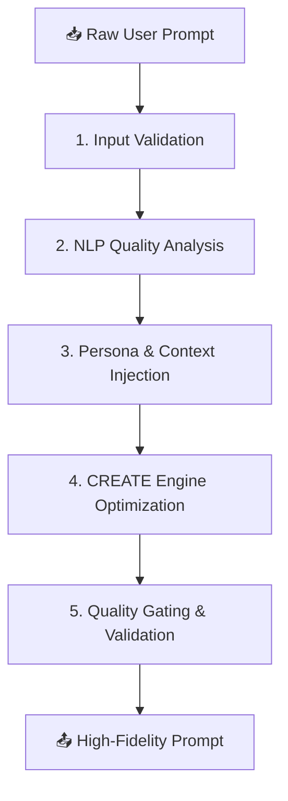

<div align="center">


# ✨ PromptmaX — AI Prompt Engineering Platform

**Turn rough, simple prompts into precision-engineered, production-ready instructions.**

[Explore Platform](https://promptmax-backend.onrender.com) • [Quick Start](#-quick-start) • [Core Features](#-core-features) • [Tech Stack](#-tech-stack)

---

</div>

## 🧬 Overview

**PromptmaX** is a next-generation AI prompt engineering platform. It uses a sophisticated **9-stage optimization pipeline** to dismantle rough, vague user inputs and reconstruct them into highly structured, context-rich, and boundary-safe instructions. 

Whether you are building custom AI agents, fine-tuning model behaviors, or running automated prompt pipelines, PromptmaX ensures your AI interactions are deterministic, safe, and consistently high-quality.

---

## 🚀 Quick Start

### 📋 Prerequisites
- **Python 3.10+**
- **Supabase Account** (for cloud database storage - optional)
- **Official Mistral AI API Key** (for prompt enhancements and scoring)

### 🛠️ Local Installation

1. **Clone the Repository**
   ```bash
   git clone https://github.com/Santosh-Prasad-Verma/PromptmaX.git
   cd PromptmaX
   ```

2. **Set Up a Virtual Environment**
   ```bash
   python -m venv venv
   source venv/bin/activate  # On Windows: venv\Scripts\activate
   pip install -r requirements.txt
   ```

3. **Configure Environment Variables**
   Copy the example environment file and fill in your keys:
   ```bash
   cp .env.example .env
   ```
   *Required variables to set:*
   * `SUPABASE_URL` & `SUPABASE_ANON_KEY`
   * `SUPABASE_JWT_SECRET` (used by Django to validate user tokens)
   * `MISTRAL_API_KEY` (used for the core prompt engineering models)

4. **Initialize the Database & Run**
   ```bash
   cd backend
   python manage.py migrate
   python manage.py runserver
   ```
   Open **[http://localhost:8000](http://localhost:8000)** in your browser to start using the app!

---

## 🧠 Core Features

* **⚡ 9-Stage Enhancement Pipeline**: Automates the CREATE prompt algorithm (Context, Role, Exclusions, Action, Theme, Evaluation) with iterative self-healing loops to polish prompts until they hit target scores.
* **📈 6-Dimension Quality Scoring**: Real-time quality evaluation analyzing *Clarity, Specificity, Structure, Context, Constraints, and Output Formatting* with interactive heatmap feedback.
* **🔄 A/B Testing & Variations**: Generates three distinct style variations (Concise, Detailed, and Structured) for comparing responses.
* **🌐 Web Search Context Injection**: Automatically crawls and pulls real-time information from the web to ground prompts with fresh factual context.
* ** Automated Cloud History Sync**: Safe dual-write database synchronization that auto-saves your prompt enhancements directly to the cloud.

---

## 🏗️ Pipeline Flow



---

## 🏗️ Tech Stack

* **Frontend**: Vanilla CSS (Premium cream & evergreen theme), Vanilla JavaScript, Lucide Icons, Google Fonts (Inter, EB Garamond)
* **Backend**: Django (Python 3.10+), Django REST Framework
* **Database**: SQLite (Local development) / PostgreSQL (Production)
* **Authentication**: Supabase Auth (SSO Integration with JWT validation)
* **AI Models**: Mistral AI API (exclusive official models)
* **Background Tasks**: Celery, Redis (for async website scraping and prompt history synchronization)

---

## 📁 Repository Structure

```markdown
├── backend/                  # Django backend application
│   ├── enhancer/             # Core prompt logic, views, models, and tasks
│   └── promptx_project/      # Main Django server configuration and settings
├── frontend/                 # Premium responsive frontend client
│   ├── pages/                # Clean public pages and interactive chat workspace
│   ├── scripts/              # Auth bridge, Supabase client, and chat controller
│   └── styles/               # CSS styling sheets (cream theme & premium popups)
├── supabase/                 # Database migrations and dashboard email templates
└── render.yaml               # Infrastructure-as-code deployment blueprint
```

---

<div align="center">

**PromptmaX — Built for modern AI teams.**  
Distributed under the MIT License.

</div>
